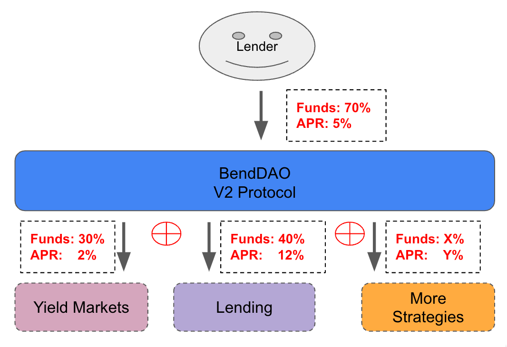

# Overview

BendDAO V2 Protocol brings you composable lending and leverage. It allows anyone to borrow in an overcollateralized fashion, leverage savings on MakerDAO, leverage stake on Lido, leverage restake with EigenLayer derivatives, bringing together lending and leverage in the same protocol!

V2 Protocol has three user sides to it:

* Lenders deposit assets to earn passive yield.
* Borrowers can use ERC20 & NFT as collaterals to borrow assets in an overcollateralized fashion.
* Leverage users can use NFT as collaterals to borrow assets to create leverage positions, which can be used across DeFi, NFTs, RWA, etc.

<figure><figcaption>
BendDAO V2
</figcaption></figure>

## Cool Features

*   #### **Restaking Specialized Loan**

    BendDAO V2 introduces the first restaking service for NFT holders to earn passive income by Specialized Loan. This groundbreaking feature for bluechip NFTs comes with the V2 update—an exciting development in the realm of DeFi and Restaking. This **Restaking Specialized Loan** feature, leveraging liquid staking and restaking, is designed to revolutionize how NFT holders can capture ETH ecosystem development benefits when holding NFTs.
* **Cross Margin Lending**. Based on the whole account, borrowers can use multiple assets as collateral for lending and lower the liquidation risk.
* **Isolated Margin Lending**. Based on individual NFT assets for lending, when these NFT assets face liquidation, and auction will be triggered, which is more in line with market pricing.
* **Custom Lending Pools**. Developers can create their own lending pools, customize pool listing assets and risk parameters according to their requirements, such as LTV, interest rate model, etc.
* **Custom Interest Rates**. The interest rate is determined by the market conditions of the collateral, and different types of assets have different interest rates.
* **Modularity**. V2 Protocol is not just a couple of pools, it's an new architecture of smart contracts which are plug-and-play enabled.
* **Composability**. Other protocols can offer leverage to their users with the help of V2 Protocol, without modifying anything in their own architecture.

