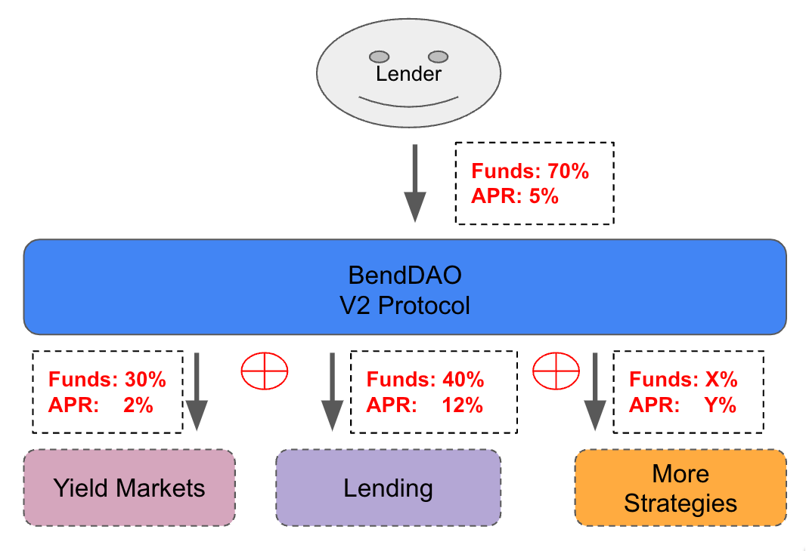

# Interest Rate Models

V2 protocol is an Interest Rate Model (IRM) agnostic protocol, meaning it can support any interest rate model for its lending pool assets. In V2, the interest borrowers pay in a given asset is defined by the IRM chosen at asset listing among a governance-approved set.

## Rationale

V2 protocol's interest rate model is calibrated to manage liquidity risk and optimize utilization. The borrow interest rates come from the Utilization Rate $$U$$.

$$U$$ is an indicator of the availability of capital in the pool. The interest rate model is used to manage liquidity risk through user incentivizes to support liquidity:

* When capital is available: lower interest rates to encourage loans.
* When capital is scarce: higher interest rates encourage repayments for the loans and additional deposits.

### Interest Rate Curve

The V2 protocol can adjust different interest rate parameters for different assets based on the market demand. The better the performance of an asset in the market, the more competitive the corresponding borrowing interest rate will be, and the change in the interest rate curve will be smoother.

<figure><figcaption>
Interest Curve Example
</figcaption></figure>

### Rate for Yield Markets

We can customize interest rate parameters for the Yield Market to make the fluctuation of borrow interest rate more moderate.

<figure><figcaption>
Yield Market Rate Example
</figcaption></figure>
